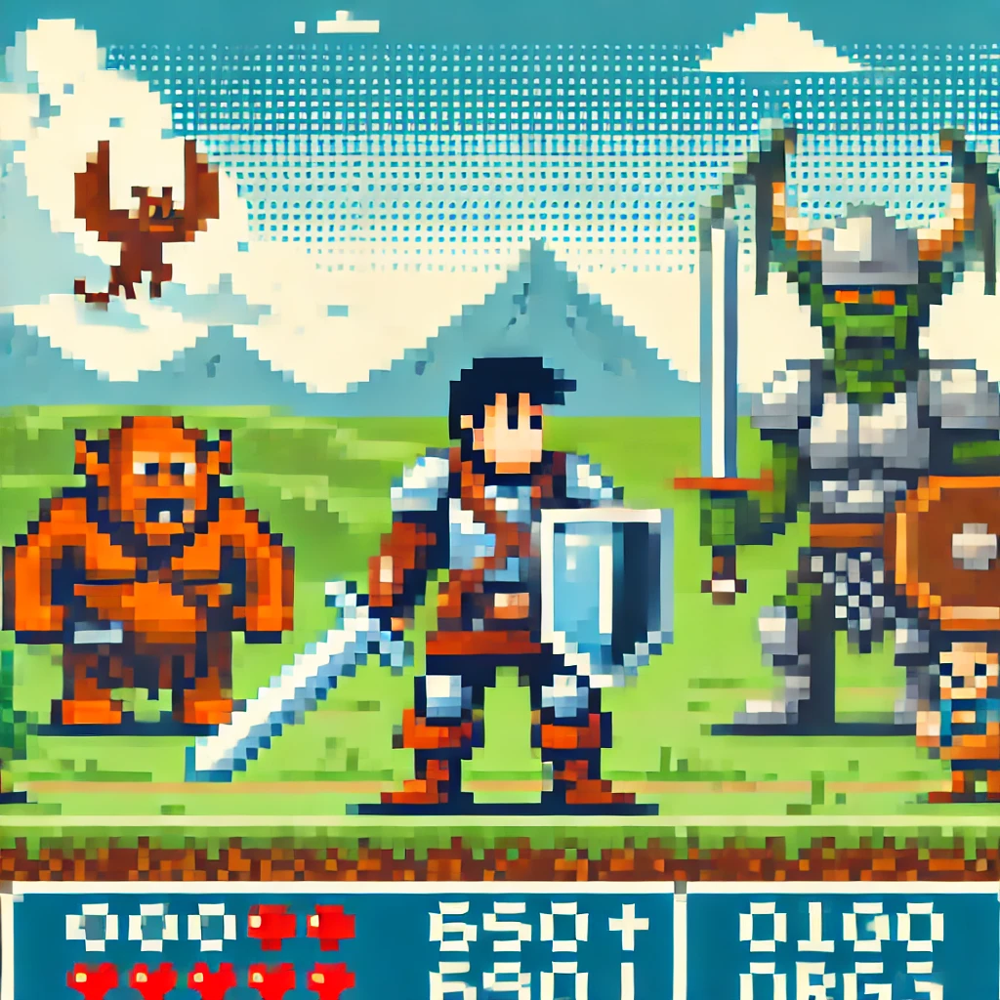

# QuantumPath Saga

**QuantumPath Saga** is a dynamic, text-based RPG that provides a procedurally generated adventure with each playthrough. The game evolves based on your choices, offering new storylines, characters, and events every time you play.

## Features
- **Dynamic Story Generation**: Your decisions influence the storyline, resulting in different outcomes.
- **Random Events & NPCs**: Encounter various characters and unexpected challenges throughout the game.
- **Level Progression & Unlocks**: As you level up, new, more powerful enemies and items become available.
- **Armor & Shields**: Equip armor and shields to defend against enemy attacks.
- **Shops & Items**: Purchase health potions, weapons, and armor to enhance your character’s survival.
- **Experience & Leveling System**: Gain experience points from battles to level up and unlock stronger enemies and equipment.
- **Modular Code Design**: Built to be easily extended for future updates and new features.

## Getting Started

1. **Clone the Repository**: Download the game from the repository and ensure you have the required dependencies installed.
2. **Run the Game**: Simply run the main game file and begin your journey.
3. **Character Creation**: Enter your player's name to start your adventure.
4. **Battles**: Fight enemies, heal, or retreat strategically based on your situation.
5. **Visit Shops**: After battles, spend your earned gold on essential items like health potions or stronger weapons and armor.
6. **Level Up**: Earn experience points, progress through levels, and unlock new weapons, armor, and enemies as you play.

## How to Contribute
Contributions to **QuantumPath Saga** are welcome! Feel free to share your ideas, submit pull requests, or report issues to improve the game.

## License
This project is licensed under the MIT License. More details can be found in the license file.
